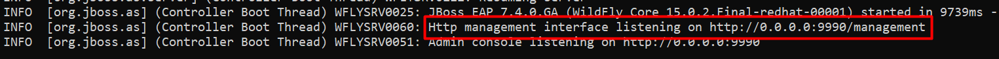
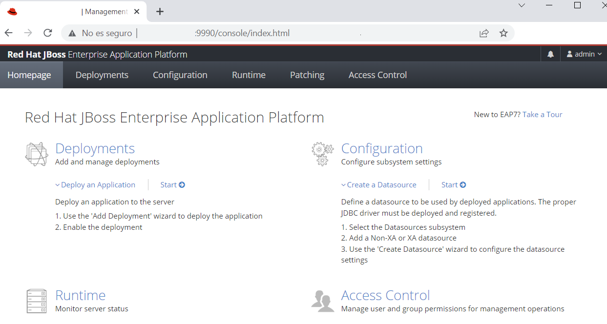

# How to test and configure JBoss EAP

Before starting the server, remote connections must be allowed. 

- Edit ***standalone.xml*** configution file:
```console
    $ sudo nano /opt/jboss/EAP-7.3.0/standalone/configuration/standalone.xml
```

- Look for the ***interfaces*** section and edit as follows:
    ```console
    <interfaces>
        <interface name="management">
            <inet-address value="${jboss.bind.address.management:0.0.0.0}"/>
        </interface>
        <interface name="public">
            <inet-address value="${jboss.bind.address:0.0.0.0}"/>
        </interface>
    </interfaces>
    ```

- Start the server running the following command:
    ```console
    /opt/jboss/EAP-7.4.0/bin/standalone.sh
    ```

- Server should be up and running. Its management interface IP and PORT should be shown on the console:
    

- Open a web browser and login into de server management interface. Remember to use the *username* and *password* established during the ***installation***:



Follow up with the [Uninstall](UNINSTALL.MD) procedure.
    
[Go back to README.MD](README.MD)
